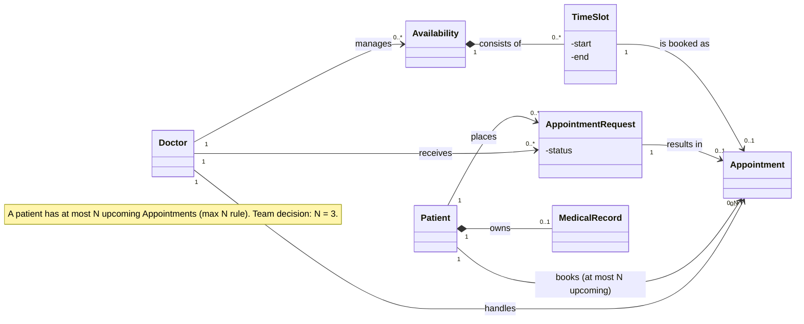

```mermaid
classDiagram
    direction LR

    %% Approved classes
    Patient
    Doctor
    AppointmentRequest
    Availability
    TimeSlot
    Appointment
    AppointmentLimit
    MedicalRecord
    Payment
    GPS_Location
    Notification
    Clinic

    %% Attributes (only the ones named in the input)
    AppointmentRequest : -status
    TimeSlot : -start
    TimeSlot : -end

    %% Associations with multiplicities
    Patient "1" --> "0..*" AppointmentRequest : places
    Doctor "1" --> "0..*" AppointmentRequest : receives
    Doctor "1" --> "0..*" Availability : manages
    Availability "1" *-- "0..*" TimeSlot : consists of
    TimeSlot "1" --> "0..1" Appointment : is booked as
    AppointmentRequest "1" --> "0..1" Appointment : results in
    Patient "1" --> "0..N" Appointment : books (at most N upcoming)
    Doctor "1" --> "0..*" Appointment : handles
    Patient "1" *-- "0..1" MedicalRecord : owns

    %% Rule class
    note for AppointmentLimit "A patient has at most N upcoming Appointments (max N rule). Team decision: N = 3."
```
