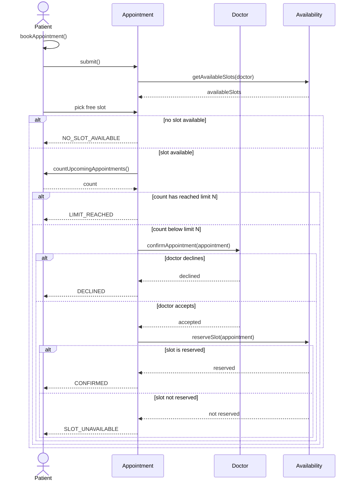

```mermaid
sequenceDiagram
    actor Patient
    participant Appointment
    participant Doctor
    participant Availability

    Patient->>Patient: bookAppointment()
    Patient->>Appointment: submit()

    Appointment->>Availability: getAvailableSlots(doctor)
    Availability-->>Appointment: availableSlots
    Patient->>Appointment: pick free slot

    alt no slot available
        Appointment-->>Patient: NO_SLOT_AVAILABLE
    else slot available
        Appointment->>Patient: countUpcomingAppointments()
        Patient-->>Appointment: count

        alt count has reached limit N
            Appointment-->>Patient: LIMIT_REACHED
        else count below limit N
            Appointment->>Doctor: confirmAppointment(appointment)

            alt doctor declines
                Doctor-->>Appointment: declined
                Appointment-->>Patient: DECLINED
            else doctor accepts
                Doctor-->>Appointment: accepted
                Appointment->>Availability: reserveSlot(appointment)

                alt slot is reserved
                    Availability-->>Appointment: reserved
                    Appointment-->>Patient: CONFIRMED
                else slot not reserved
                    Availability-->>Appointment: not reserved
                    Appointment-->>Patient: SLOT_UNAVAILABLE
                end
            end
        end
    end
```
