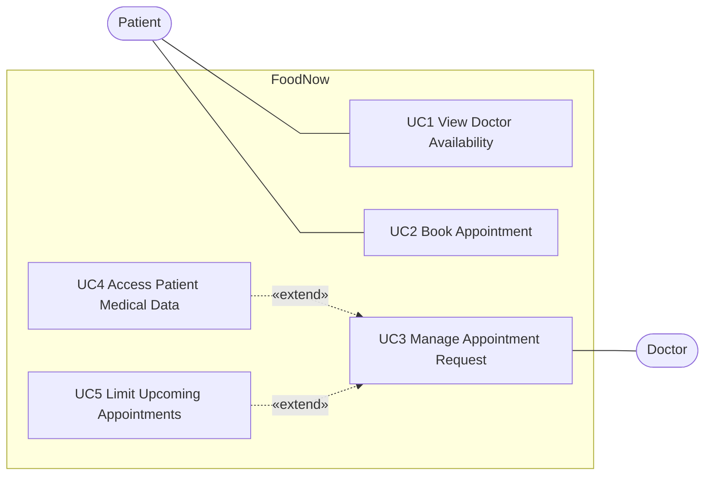

```mermaid
%%{init: {"flowchart": {"curve": "linear"}}}%%
flowchart LR
    %% Actors
    C([Patient ])
    R([Doctor ])

    %% System boundary
    subgraph FoodNow
        UC1[UC1 View Doctor Availability]
        UC2[UC2 Book Appointment]
        UC3[UC3 Manage Appointment Request]
        UC4[UC4 Access Patient Medical Data]
        UC5[UC5 Limit Upcoming Appointments]
    end

    %% Actor associations
    C --- UC1
    C --- UC2
    UC3 --- R

    %% Extend relationships
    UC4 -.->|"«extend»"| UC3
    UC5 -.->|"«extend»"| UC3
```
